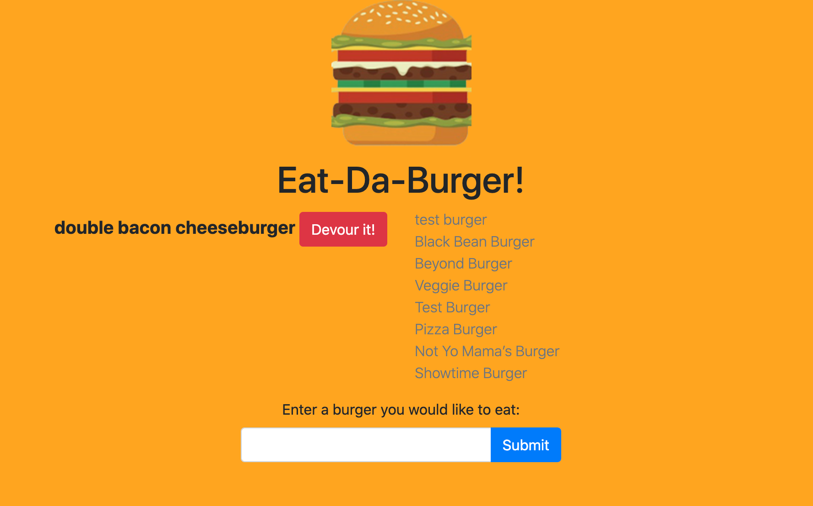

# [Eat-Da-Burger!](https://blooming-springs-66599.herokuapp.com/)

A [burger logger](https://blooming-springs-66599.herokuapp.com/) with MySQL, Node, Express, Handlebars and a homemade ORM.

## Table of Contents

- [Usage](#usage)
- [Contributing](#contributing)
- [Questions](#questions)
- [License](#license)

## Usage

1. Navigate to <https://blooming-springs-66599.herokuapp.com/>.

1. Type in the name of a burger you would like to eat (e.g. "Impossible Whopper" or "Cheeseburger") and click the blue `Submit` button.

1. The burger you typed it will appear on the left side of the page. To eat the buger, click the red `Devour it!` button.

1. The devoured burger will move from the left side to the right side of the page.

[back to Table of Contents](#table-of-contents)

## Contributing

Your contribution is most welcome! Please refer to the contributing guidelines when making contributions to this project.

Please note that this project is released with a [Contributor Code of Conduct](code_of_conduct.md). By Participating in this project, you agree to abide by its terms.

[back to Table of Contents](#table-of-contents)

## Questions

Please direct any and all questions to [thadkingcole](https://github.com/thadkingcole) or via email at [thadjcole@gmail.com](mailto:thadjcole@gmail.com).

[back to Table of Contents](#table-of-contents)

## License

[MIT](LICENSE) copyright (c) 2020 [Thaddeus Cole](mailto:thadjcole@gmail.com).

[back to Table of Contents](#table-of-contents)
